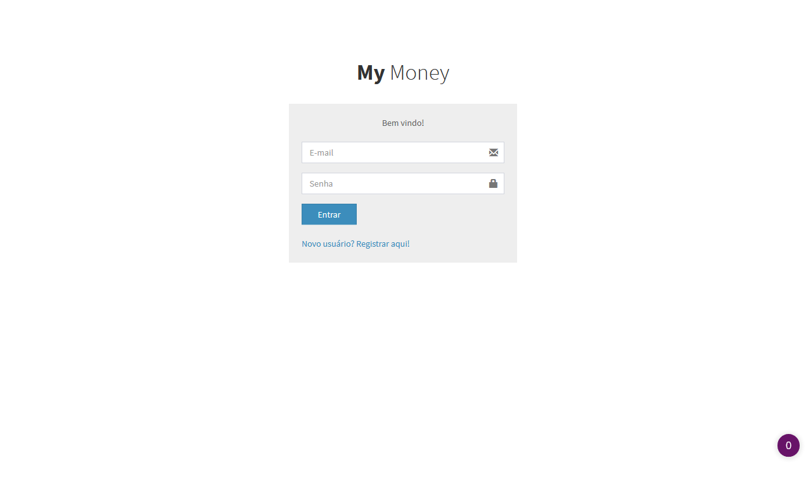
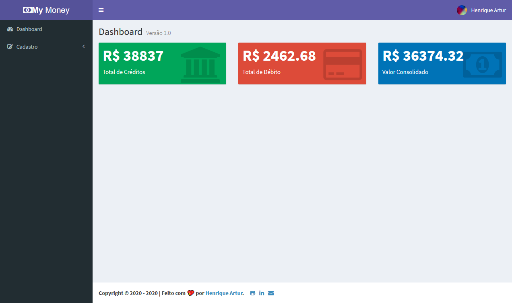
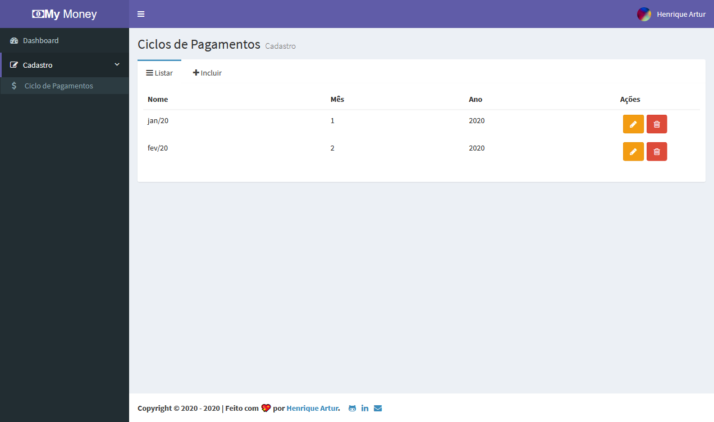
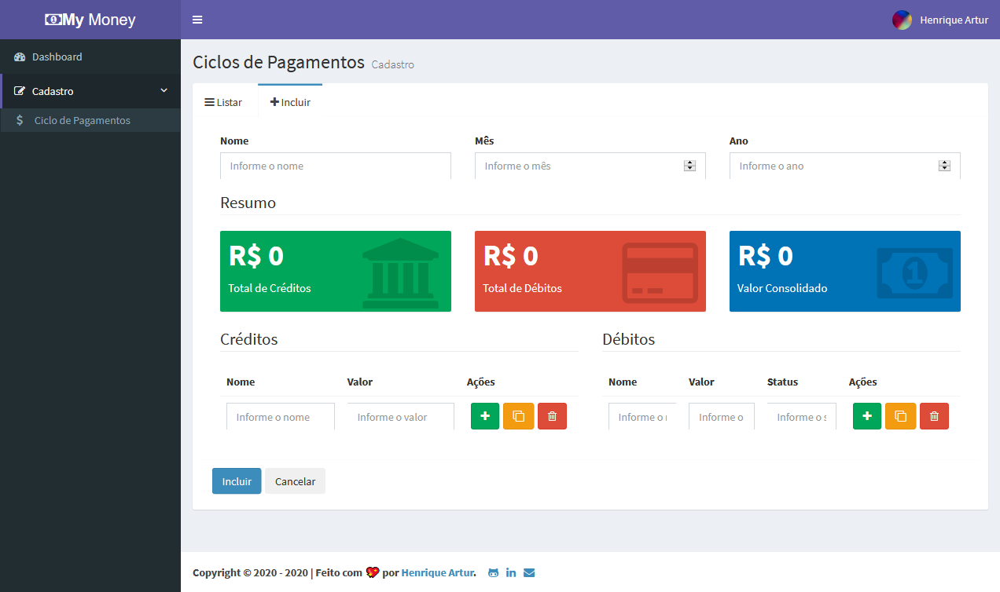

<h1 align="center" id='top'>💵 My Money App 💵</h1>

<h4 align="center">✔ Complete ✔</h4>

<p align="center">
  <a href="https://github.com/HenriqueArtur/">
    
  </a>&nbsp;&nbsp;
  <a href="https://henriqueartur.com">
    
  </a>&nbsp;&nbsp;
</p>


<p align="center">
  <a href="#about">About</a> •
  <a href="#functions">Functions</a> • 
  <a href="#images">Images</a> • 
  <a href="#project">How to run</a> • 
  <a href="#technologies">Technologies</a> • 
  <a href="#author">Author</a>
</p>

<h2 id='about'>💻 About <a href="#top">🔝</a></h2>
My Money App is a REST application using CRUD operations that manages billing cycles and was developed as an activity in Cod3r's React course. 

---

<h2 id='functions'>⚙️ Functions <a href="#top">🔝</a></h2>

- Sign up
- Sign in
- Dashboad
    - Show total credits
    - Show total debts
    - Show consolidated value
- Cadastro (Register)
    - Ciclo de pagamentos (Billing Cycles)
        - Incluir (Create) 
        - Listar (Read)
        - Alterar (Update)
        - Excluir (Delete)

---

<h2 id='images'>🌻 Images <a href="#top">🔝</a></h2>

#### Login

#### Dashboar

#### List

#### Operations


---

<h2 id='project'>🚀 How to run <a href="#top">🔝</a></h2>
This project is divided into two parts:

1. Backend
2. Frontend

### ❗ Requirements
Before you begin, you will need to have the following tools installed on your machine:  [Git](https://git-scm.com/), [Node.js](https://nodejs.org/en/). 

Clone this repository: ```$ git clone https://github.com/HenriqueArtur/my-money-app.git```

#### 🎲 Backend (server)
```bash
# Rename 'env_file' file to '.env' in backend/src

# Set authentication key in 'authSecret' in .env
# write whatever you want - e.g. 'ehu1u21)&*dfs'

# Access backend folder on terminal
$ cd backend

# Install dependecies
$ npm i

# Run backend
# dev
$ npm run dev
# OR
# production
$ npm run production

# Backend start on port: 3003
```

#### 🧭 Frontend (Web)
```bash
# Access frontend folder on terminal
$ cd frontend

# Install dependecies
$ npm i

# Run front end
$ npm start

# Frontend start on port: 3000 - access http://localhost:3000 
```

---

<h2 id='technologies'>🛠 Technologies <a href="#top">🔝</a></h2>

### 🎲 Backend
[]()
[]()
[]()
[]()
[]()
[]()
[]()
[]()

### 🧭 Frontend 
[]()
[]()
[]()
[]()
[]()
[]()
[]()
[]()
[]()
[]()
[]()
[]()
[]()

---

<h2 id='author'>🦸‍♂️ Author <a href="#top">🔝</a></h2>
<p>
    <a href="https://henriqueartur.com">
        
        <br />
        <author><b>Henrique Artur</b></author>
    </a>
</p>
<p>
  <a href="mailto:contato@henriqueartur.com">
    
  </a>&nbsp;&nbsp;
  <a href="https://www.linkedin.com/in/henriqueartur/">
    
  </a>&nbsp;&nbsp;
  <a href="https://github.com/HenriqueArtur/">
    
  </a>&nbsp;&nbsp;
</p>