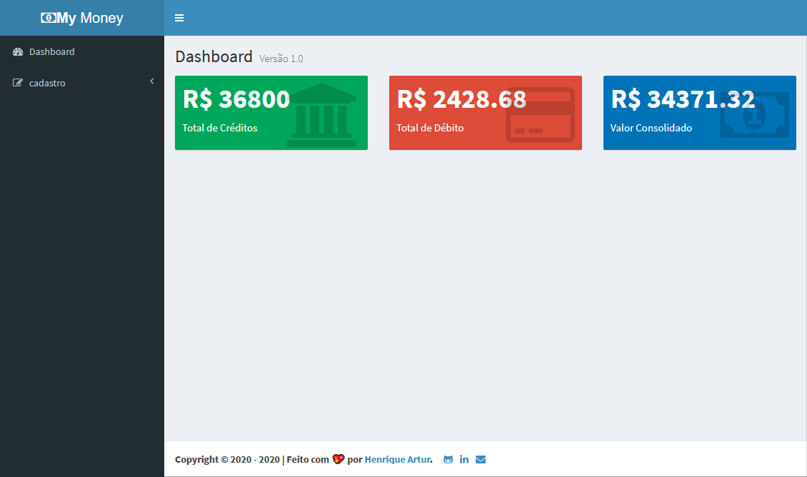

<h1 align="center" id='top'>💵 My Money App 💵</h1>

<h4 align="center">🚧 In Progress 🚧</h4>

  &nbsp;&nbsp;
  &nbsp;&nbsp;

  <a href="#about">About</a> •
  <a href="#functions">Functions</a> • 
  <a href="#images">Images</a> • 
  <a href="#project">How to run</a> • 
  <a href="#technologies">Technologies</a> • 
  <a href="#author">Author</a>

<h2 id='about'>💻 About <a href="#top">🔝</a></h2>
My Money App é uma aplicação REST utilizando as operações do CRUD que gerencicia ciclos de faturamentos e foi desenvolvida como atividade do curso de React da Cod3r. 

---

<h2 id='functions'>⚙️ Functions <a href="#top">🔝</a></h2>

- Dashboad
    - Show total credits
    - Show total debts
    - Show consolidated value
- Cadastro (Register)
    - Ciclo de pagamentos (Billing Cycles)
        - Incluir (Create) 
        - Listar (Read)
        - Alterar (Update)
        - Excluir (Delete)

---

<h2 id='images'>🌻 Images <a href="#top">🔝</a></h2>

---

<h2 id='project'>🚀 How to run <a href="#top">🔝</a></h2>

### Requirements

#### 🎲 Backend (server)

#### 🧭 Frontend (Web)

---

<h2 id='technologies'>🛠 Technologies <a href="#top">🔝</a></h2>

  
  
  
  
  
  

---

<h2 id='author'>🦸‍♂️ Author <a href="#top">🔝</a></h2>

    <a href="https://henriqueartur.com">
        
         
        <author><b>Henrique Artur</b></author>
    </a>

  &nbsp;&nbsp;
  &nbsp;&nbsp;
  &nbsp;&nbsp;

